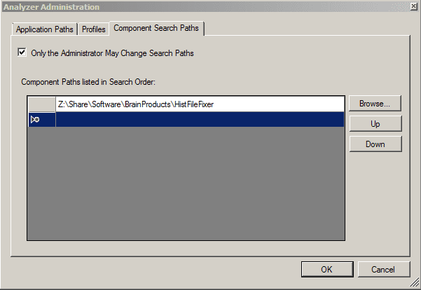
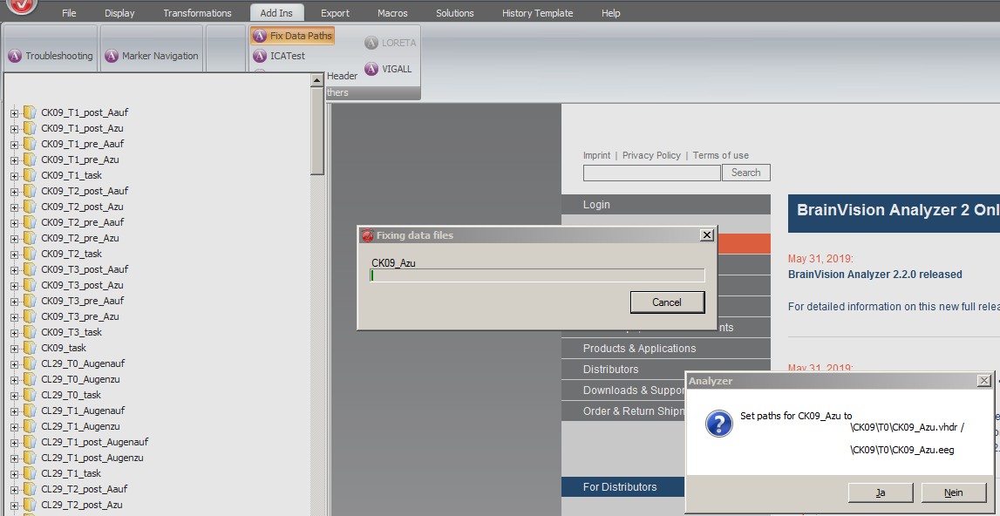

# Brainvision Analyzer history file fixer

[Brainvision Analyzer](https://www.brainproducts.com/productdetails.php?id=17)
stores the EEG edit history (history files) separately from the raw EEG data.
The path to the raw EEG files is stored in the history files and changes (e.g.
after moving the history files or renaming the raw file folder) are
automatically detected and fixed in most cases.

In some cases, however, this doesn't happen:

- you had only shortcuts to the EEG data in your raw data folder
- the EEG data was moved to a subfolder
- the EEG file was renamed (but the new name appears in the Brainvision
  header file (`.vhdr`))

The history file fixer seeks to address these problems by matching all EEG
files in a directory to your history files and replaces the paths in the
history files.

The history file fixer can be used in two ways:

## Standalone executable

The executable depends on either the .NET framework (4.7.2) or .NET core
(and should therefore work on Linux / macOS).
It doesn't require any part of Brainvision Analyzer (and therefore no license
nor dongle).

You can start it without arguments (after which you are prompted to select a
workspace files (`.wksp2`)) or supply a workspace file as first argument.
This will scan the entire history file directory and raw data directories
recursively.

You can also supply a history file (`.ehst2`) and EEG data file (most likely
`.eeg`) to directly set the path for a history file.

## Analyzer Add-In

Simply copy the `dll` files to your Analyzer directory or add the downloaded
folder to the analyzer config:

After restarting Analyzer, you can use the "Fix data paths" addin to fix all
data files in the active workspace Analyzer can't find a data file for.

